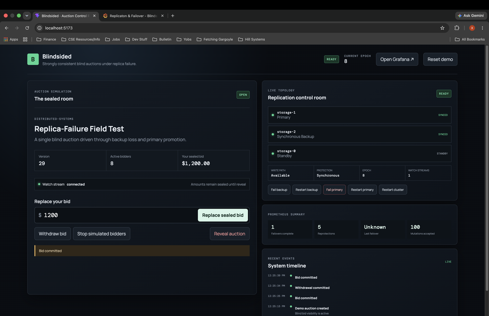
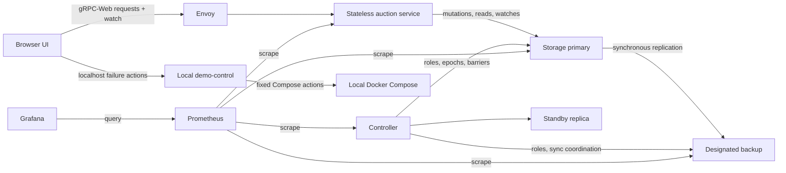
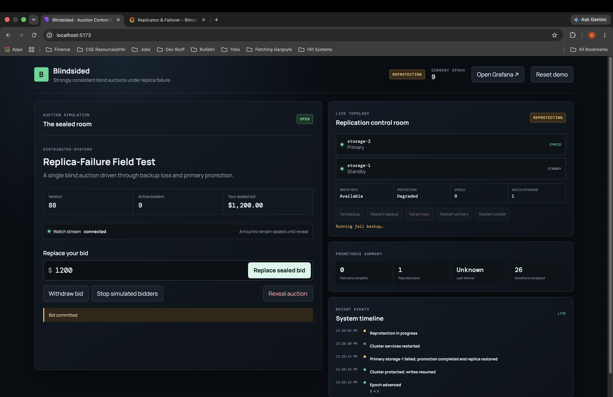
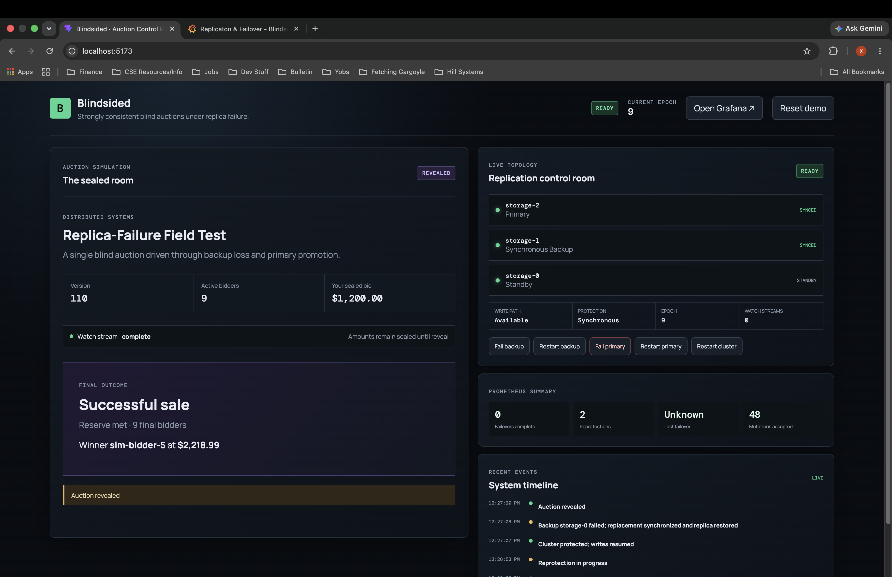

# Blindsided

Blindsided is a replicated blind-auction backend demonstrating synchronous
primary-backup replication, epoch-fenced failover, synchronization barriers,
durable idempotency, optimistic concurrency control, live gRPC streams,
observability, and service-tier autoscaling. Its single-page frontend combines
an auction simulation with a distributed-systems control room.



## Highlights

- Mutations are acknowledged only after the primary and its designated
  synchronous backup commit.
- Durable mutation receipts make retries idempotent, while version numbers
  provide optimistic concurrency control.
- The controller fences stale epochs and coordinates promotion,
  synchronization, and automatic backup reprotection.
- Reads come from the authoritative primary; watch streams publish committed
  privacy-safe auction projections.
- Before reveal, clients see auction metadata and active-bidder count—not bid
  amounts, bidder identities, reserve status, or the leader.
- Prometheus metrics and provisioned Grafana dashboards expose request,
  replication, synchronization, and failover behavior.
- Kubernetes scales the stateless auction-service tier independently of the
  fixed three-member storage cluster.

## Demo

The control room demonstrates auction behavior, replication, failover,
reprotection, and reveal in a single workflow.


## Architecture



Envoy translates browser gRPC-Web traffic. Stateless service nodes apply
auction visibility and bounded OCC retries, while all replication and
consistency mechanisms live in storage. The centralized controller assigns
roles and epochs. The demo-control process is a localhost-only Compose adapter,
not a production administration API.

See [the architecture document](docs/architecture.md) for the request and
failure paths, [the auction specification](docs/auction-specification.md) for
domain semantics, [the ADRs](docs/ADRs/) for design decisions, and
[the test plan](docs/test-plan.md) for evidence and boundaries.

## Correctness guarantees

The implementation provides:

- primary-authoritative reads and synchronous protected writes;
- acknowledged-write durability across a single replica failure;
- stale-epoch rejection and barrier-gated promotion;
- full-state synchronization before a replacement becomes the designated
  backup;
- durable auction state, acceptance order, and idempotency receipts across
  storage restart;
- privacy-preserving committed watch updates;
- deterministic reveal, winner selection, and tie-breaking.

Writes intentionally become unavailable when synchronous protection cannot be
established. This is primary-backup replication, not quorum consensus.

## Failure Recovery

Backup loss transitions the cluster into a reprotection workflow before
full synchronous protection is restored.



## Quick start

Prerequisites are Docker with Compose v2, Python 3.11+, and Node.js 24 with npm.
From the repository root:

```bash
python3 -m venv .venv
.venv/bin/python -m pip install -r requirements.txt
docker compose -f deploy/compose/docker-compose.yaml up -d --build --remove-orphans
```

Start the localhost-only failure-control adapter:

```bash
cd frontend
npm ci
npm run demo-control
```

In another terminal:

```bash
cd frontend
cp .env.example .env.local
npm run dev
```

Open `http://localhost:5173`. Envoy listens on `http://localhost:8080`,
Prometheus on `http://localhost:9090`, and Grafana on
`http://localhost:3000` (`admin` / `admin` for this local demo).

Run the principal browser flow after installing Chromium:

```bash
cd frontend
npx playwright install chromium
npm run test:e2e
```

## Demo flow

1. Create an auction and start simulated bidders.
2. Place a user bid and observe only the allowed sealed-auction projection.
3. Fail the backup and watch automatic synchronization and reprotection.
4. Fail the primary and observe promotion, epoch advancement, and recovery.
5. Reveal the final permitted result.
6. Open Grafana for detailed replication and failover metrics.

## Validation

The recorded final validation is:

- 394 backend tests and 86 subtests passed, covering domain, service,
  integration, distributed, observability, and deployment behavior;
- the complete evaluation suite and ordered backup-failure, primary-failover,
  watch, and restart-durability scenarios passed;
- `observability_check.py` verified populated metric families and provisioned
  dashboards;
- `kubernetes_scaling.sh` verified stateless service-tier HPA behavior without
  scaling storage membership;
- frontend lint and production build passed;
- the principal Playwright end-to-end demo passed;
- the demo-control adapter passed Python compilation.

Every pull request runs deterministic backend and frontend checks. The
Docker-based distributed scenarios run in a separate weekly/manual workflow
because they manipulate isolated containers and take materially longer.
Kubernetes scaling is a local known-cluster check. Exact commands and CI
rationale are in [continuous integration](docs/continuous-integration.md) and
[evaluation](tools/evaluation/README.md).

## Final Auction Outcome

Blind bids remain sealed until reveal. After reveal, the final permitted
outcome becomes visible.



## Design tradeoffs

- Primary-backup was chosen over quorum replication to make synchronous
  acknowledgement and failover barriers explicit.
- Correctness wins over write availability when protection is lost.
- A centralized controller simplifies membership and epoch coordination but is
  not itself a replicated control plane.
- The browser simulation demonstrates concurrency and failure behavior; it is
  not production workload infrastructure.
- Failure controls remain local and Compose-specific to avoid exposing an
  administrative Docker API.

## Limitations

- Demo identities are trusted inputs; there is no authentication or
  authorization model.
- Protobuf money fields remain floating point for compatibility and require
  integer minor units for a production contract.
- The UI manages one demo auction at a time.
- Failure actions target the repository's fixed Compose services.
- Prometheus scrape intervals can miss brief transitions.
- The current histogram cannot identify the latest individual failover
  duration.
- Resetting the demo clears browser state but does not delete durable auction
  records.
- Blindsided is a distributed-systems demonstration, not a production
  marketplace.
