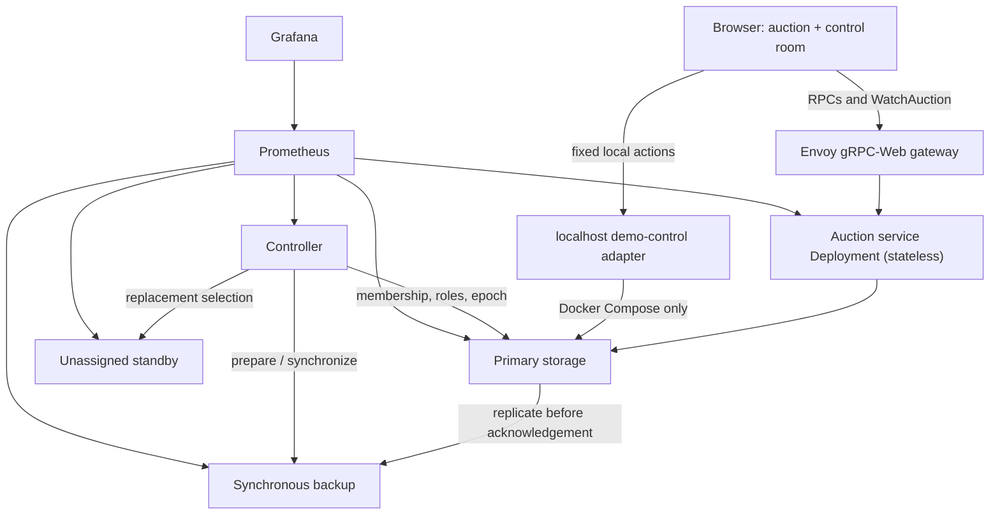
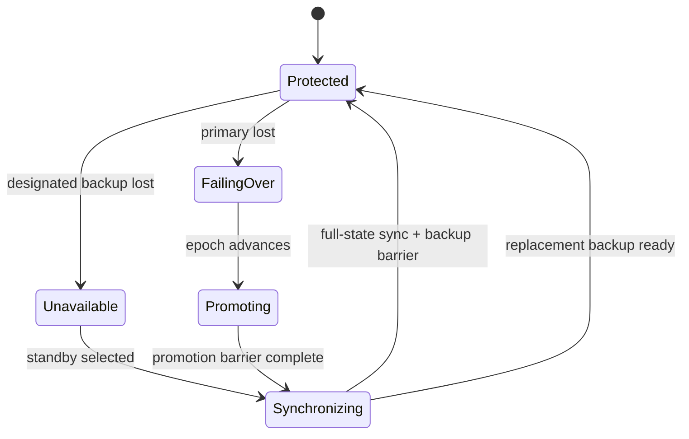

# Architecture

## System boundary

Blindsided is a blind-auction application wrapped around a deliberately small
distributed storage system. The browser, Envoy gateway, stateless auction
service, controller, three storage processes, Prometheus, and Grafana form the
demonstration. Docker Compose is the primary local environment; Kubernetes
demonstrates independent scaling of the stateless tier.

The browser simulation and localhost demo-control adapter are demonstration
tools. Authentication, payment, settlement, and remote administration are
outside the system boundary.

## Request, mutation, and read paths

Browser calls arrive through Envoy as gRPC-Web and are forwarded to an auction
service instance. The service tier owns public API projection, auction-level
request handling, and bounded optimistic-concurrency retries. It does not own
replication.

For a mutation, the service resolves the controller's current primary and
submits the expected auction version, request identity, and current epoch.
Storage validates the domain transition and idempotency receipt. The primary
durably applies the mutation and sends it to the designated backup. Success is
returned only after both commits complete. If required protection cannot be
established, writes are unavailable rather than acknowledged unsafely.

Reads are primary-authoritative. They do not load-balance across replicas, which
prevents a synchronized-but-not-authoritative node from serving stale state.
Public responses pass through the same visibility projection used by search and
watch updates.

## Watch-stream path

`WatchAuction` is served through the auction service and follows committed
storage changes. A subscriber receives privacy-safe snapshots; rejected or
uncommitted mutations do not become watch events. Streams reconnect around
topology changes and continue from authoritative state. The frontend uses the
watch version to drive versioned mutations because `GetAuction` does not expose
that internal concurrency value.

## Controller and replica roles

The controller tracks registered storage members, health, current primary,
designated backup, and epoch. Storage membership consists of one primary, one
synchronous backup, and an unassigned standby in the normal three-node
deployment.

The controller coordinates roles but does not move auction consistency into
the service tier. Replication, durable state, idempotency, fencing, and
readiness enforcement live in storage.

## Fencing and readiness barriers

Every authoritative assignment carries an epoch. Storage rejects stale epochs,
preventing an old primary from accepting mutations after a newer assignment.
Promotion is not merely a role label change: a candidate must persist the
higher-epoch role and complete the promotion readiness barrier before accepting
writes.

After backup loss, the controller selects the standby and initiates full-state
synchronization from the primary. The candidate persists auction state,
acceptance-order metadata, and idempotency receipts before becoming the
designated synchronous backup. Only then is protected readiness restored.
After primary loss, the synchronized backup is promoted and the remaining
replica is synchronized as its replacement backup. These barriers prevent
acknowledgement during unsafe intermediate states.

`READY`, `REPROTECTING`, `FAILING_OVER`, and `UNAVAILABLE` in the frontend are
derived presentation states computed from Prometheus role, health, readiness,
and epoch metrics. They are not additional backend consensus states.

## Durability and failure behavior

Each storage node persists its protobuf snapshot to its configured state path.
Restart restores auction records, versions, deterministic acceptance order,
role/epoch preparation, and durable idempotency information. A restarted node
does not become authoritative merely because it has data; controller assignment,
epoch checks, and synchronization barriers still apply.

During backup failure, the current primary can remain readable but mutations
are rejected until a new synchronous backup is ready. During primary failure,
the cluster is temporarily unavailable until promotion completes. A restored
old primary returns fenced and is synchronized into a non-authoritative role.

## Observability

Each backend role exposes Prometheus metrics for requests, mutations,
replication, commits, retries, watches, roles, readiness, epochs,
synchronization, promotion, and failover. Prometheus scrapes the processes and
Grafana queries Prometheus through provisioned dashboards. Metrics visualize
runtime evidence; correctness is asserted by automated tests and evaluation
drivers.

Scrape sampling can miss short transitions, and histogram aggregates cannot
identify the duration of the most recent individual failover. The UI preserves
those limits instead of inferring unsupported values.

## Kubernetes scaling

Kubernetes runs auction services as a Deployment with an HPA and storage as a
three-replica StatefulSet. CPU load can scale the stateless service tier from
two to six instances. Storage membership remains fixed because service-tier
scaling and storage replication solve different problems. The controller is a
single process in this demonstration.

## Frontend and demo-control boundary

The frontend calls Envoy for auction operations and Prometheus-derived
localhost demo-control status for its control-room view. The adapter binds to
loopback by default and exposes only fixed restart/failure actions against known
Compose service names. It must run outside Compose to invoke the host Docker
CLI. It is deliberately not a production admin API and must not be deployed as
one.
